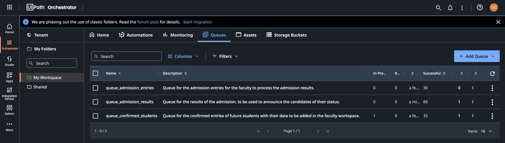
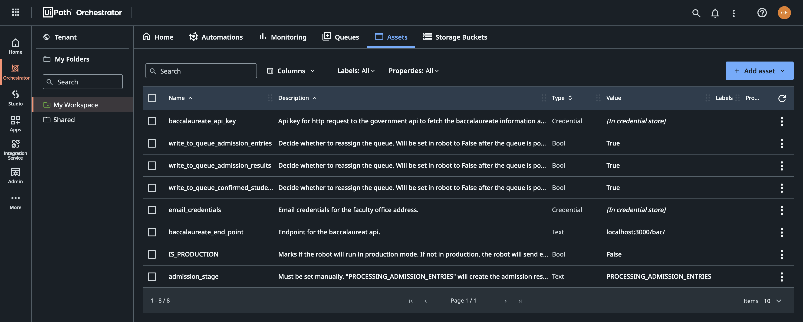

# Adimission secretary

Admission secretary robot for 3 stages of the faculty admission process:

## 1st stage: Processing admission entries

This stage will run when when the Orchestrator asset `admission_stage` is set to `PROCESSING_ADMISSION_ENTRIES`.

Uses the UIPath Orchestrator queue `queue_admission_entries` to fetch the admission entries. To not populate twice the queue in case of robot failure, system failure, user canccelation, etc. we use an asset `write_to_queue_admission_entries` which needs to be set true for the first run to populate the queue. After the queue is populated the robot will set this asset to false.

Will fetch transaction items containing the candidate's CNP and admission entry notes from an Orchestrator. The robot will fetch the candidate's baccalaureat api (we simulate one using json-server) and compute the candidate's admission final note. Will also create in the Data/Output dir the lists for each domain (MATE, INFO, CTI) and each special cases (buget, tax, etnic, rural, sri). For the rejected candidates will create a single file containing all of them (admission note below 5.0). For future use will save all the candidates note in a temp csv file.

## 2nd stage: Processing admission results

After a person updated the faculty site with the admission list, the asset `admission_stage` needs to be changed to `PROCESSING_ADMISSION_RESULTS` and the asset `write_to_queue_admission_results` needs to be set to true. The robot will then populate the queue with the admission results. After the queue is populated the robot will set this asset to false (same story as above).

The robot will fetch transaction items from the queue `queue_admission_results`. This will contain all the info about the candidate.
Then based if the candidate was accepted or rejected the robot will do the following:

- If accepted, the robot will fill a temp annual admissin file for the candidate using App UI (in our case Adobe Acrobat). After this the robot will inform the candidate via email to his chosen email address about his status, a link for the annual admissin page and the previous create file which he needs to bring to the faculty for the admission folder.
- If rejected, the robot will send the candidate an email with the rejection reason and a link to the faculty site for more info.

## 3rd stage: Processing confirmed students

After the candidates bring their admission folders to the faculty and the registrations are made, the asset `admission_stage` needs to be changed to `PROCESSING_CONFIRMED_STUDENTS` and the asset `write_to_queue_confirmed_students` needs to be set to true. The robot will then populate the queue with all the data about the candidates. After the queue is populated the robot will set this asset to false (same story as above).

The robot will fetch a transaction item from the queue `queue_confirmed_students`. The robot will generate a new unique institutional email address for the new student and save him to a small csv database of all students email addresses. The robot will also generate a temporary password for the student and send him an email with the new email address and the temporary password. The student will be able to login to the faculty site (sent by email) and change his password. Before sending the email address the robot will create the student profile (using his data previously fetched from the queue) in the faculty site.

## We use both the UIPath Orchestrator and REFrameWork

See below the images from the Orchestrator.

Also we use .csv instead .xlsx since the excel programs will try to modify a lot of types to other types (like dates... -_-)

## Documentation is included in the Documentation folder for the UIPath framework

[REFrameWork Documentation](https://github.com/UiPath/ReFrameWork/blob/master/Documentation/REFramework%20documentation.pdf)

## REFrameWork Template - **Robotic Enterprise Framework**

- Built on top of _Transactional Business Process_ template
- Uses _State Machine_ layout for the phases of automation project
- Offers high level logging, exception handling and recovery
- Keeps external settings in _Config.xlsx_ file and Orchestrator assets
- Pulls credentials from Orchestrator assets and _Windows Credential Manager_
- Gets transaction data from Orchestrator queue and updates back status
- Takes screenshots in case of system exceptions

What's been added:

- state to populate each queue dependent on the admission stage
- separate process transaction item based on admission stage
- added web api dependency for the simulated baccalaureat api
- added email dependency for sending emails to candidates

### How It Works

1. **INITIALIZE PROCESS**
1.1. ./Framework/_InitiAllSettings_ - Load configuration data from Config.xlsx file and from assets
1.2. ./Framework/_GetAppCredential_ - Retrieve credentials from Orchestrator assets or local Windows Credential Manager
1.3. ./Framework/_InitiAllApplications_ - Open and login to applications used throughout the process
2. **GET TRANSACTION DATA**
2.1. ./Framework/_GetTransactionData_ - Fetches transactions from an Orchestrator queue defined by Config("OrchestratorQueueName") or any other configured data source
3. **PROCESS TRANSACTION**
3.1. _Process_ - Process trasaction and invoke other workflows related to the process being automated
3.2. ./Framework/_SetTransactionStatus_ - Updates the status of the processed transaction (Orchestrator transactions by default): Success, Business Rule Exception or System Exception
4. **END PROCESS**
4.1. ./Framework/_CloseAllApplications_ - Logs out and closes applications used throughout the process

### For New Project

1. Check the Config.xlsx file and add/customize any required fields and values
2. Implement InitiAllApplications.xaml and CloseAllApplicatoins.xaml workflows, linking them in the Config.xlsx fields
3. Implement GetTransactionData.xaml and SetTransactionStatus.xaml according to the transaction type being used (Orchestrator queues by default)
4. Implement Process.xaml workflow and invoke other workflows related to the process being automated

## UIPath Orchestrator assets and queues

