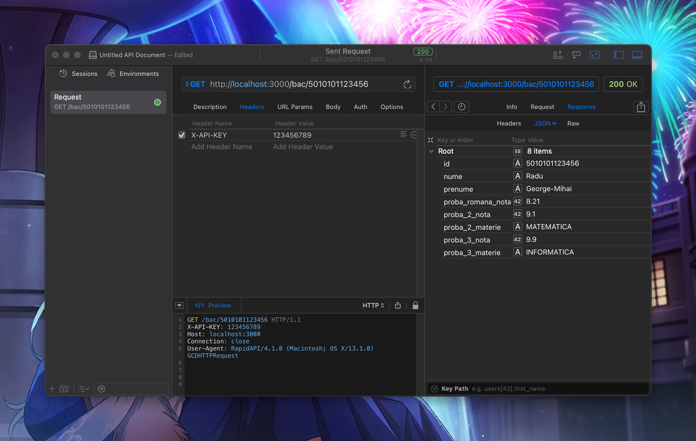
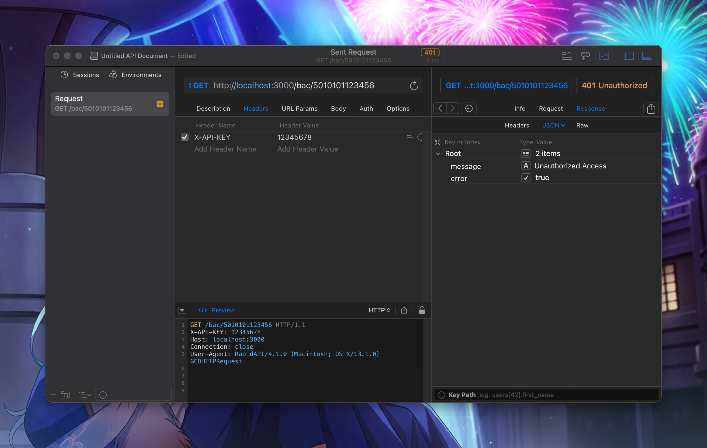

# Minimalist JSON server

_Minimalist_ JSON server to obtain data for a candidate using an unique identifier. Added a middleware for an api key authentication (single token, not really big deal here, check [here](./json_server_auth_middleware.js)).

## Installation

```bash
npm install
```

## Genereate 5 sets of data

```bash
chmod +x generate_tests_data.sh && ./generate_tests_data.sh
```

## Generate only admission data

```bash
node generate_admission_data.js
```

## Generate list of students' emails

```bash
node generate_student_emails.js
```

## Run `json-server` to simulate an api

```bash
npx json-server test_data_1/bac_data_db.json --middlewares ./json_server_auth_middleware.js
```

## Example of requests for the JSON server




